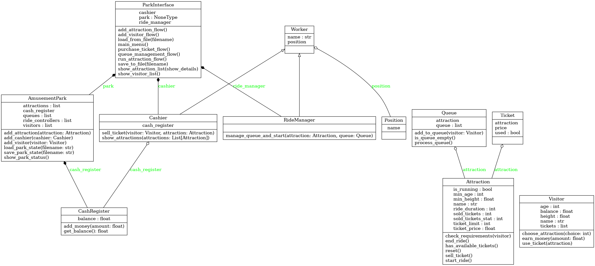
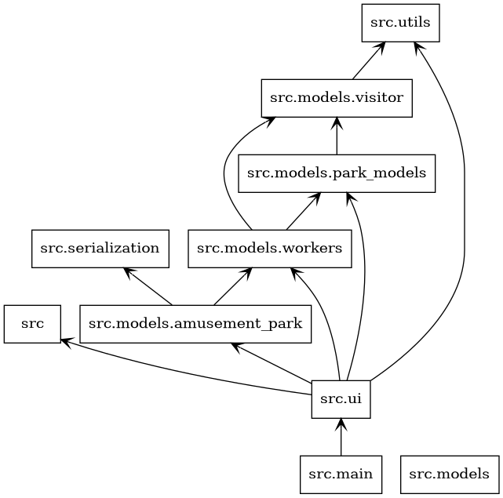

# 🎡 Amusement Park Simulator

## 📌 Overview
Amusement Park Simulator is a command-line Python application that models an amusement park where visitors can buy tickets, queue for rides, and experience attractions while adhering to safety requirements. The system persists state between runs, allowing for a continuous simulation of park operations.

## 🚀 Features
- **Attraction Management** – Add, modify, and manage amusement park attractions.
- **Visitor Interaction** – Simulate visitors entering the park, buying tickets, and joining queues.
- **Ticket System** – Ensure ticket availability and enforce purchase limits.
- **Queue System** – Manage queues dynamically based on attraction capacity.
- **Safety Checks** – Enforce minimum age and height requirements for attractions.
- **Persistence** – Save and load the park state between sessions.
- **CLI Interface** – Interact with the park using a clean command-line interface.
- **Unit Tests** – Ensure system stability with comprehensive testing.

## 🛠️ Installation
```sh
# Clone the repository
git clone https://github.com/IRomanchuk06/amusement_park.git
cd amusement_park

# Set up a virtual environment
python -m venv venv
source venv/bin/activate  # On Windows use `venv\Scripts\activate`

# Install dependencies
pip install -r requirements.txt
```

## 🎮 Usage
```sh
python -m src.main
```

### Available Commands:
- `register_visitor` – Register a new visitor.  
- `view_attractions` – Display the list of attractions.  
- `purchase_ticket` – Purchase a ticket for a visitor.  
- `join_ride_queue` – Add a visitor to a ride queue.  
- `operate_attraction` – Process the next group in the queue.  
- `park_status_overview` – Display the park’s current status.  
- `save_park_state` – Save the park state to a file.  
- `load_park_state` – Load the park state from a file.  
- `add_new_attraction` – Add a new attraction to the park.  
- `exit_system` – Exit the system.  

## 📂 Project Structure
```
📁 amusement-park-simulator
├── src
│   ├── models
│   │   ├── amusement_park.py
│   │   ├── park_models.py
│   │   ├── visitor.py
│   │   ├── workers.py
│   ├── serialization.py
│   ├── ui.py
│   ├── utils.py
│   ├── main.py
├── tests
│   ├── test_park_models.py
│   ├── test_serialization.py
│   ├── test_utils.py
│   ├── tests.py
├── docs
│   ├── classes_my_project.png
│   ├── packages_my_project.png
├── README.md
├── requirements.txt
├── .gitignore
```

## 🖼️ UML Diagrams
### Class Diagram


### Packages Diagram


## ✅ Testing
```sh
python -m unittest discover -s tests
```
## 📊 Test Coverage  

To check test coverage, use `coverage.py`:  

1. **Install `coverage` (if not installed):**  
   ```sh
   pip install coverage
   ```

2. **Run tests with coverage tracking:**  
   ```sh
   coverage run -m unittest discover -s tests
   ```

3. **Display the coverage report in the terminal:**  
   ```sh
   coverage report -m
   ```

4. **Generate an HTML report:**  
   ```sh
   coverage html
   ```
   Open `htmlcov/index.html` in a browser to view a detailed report.

