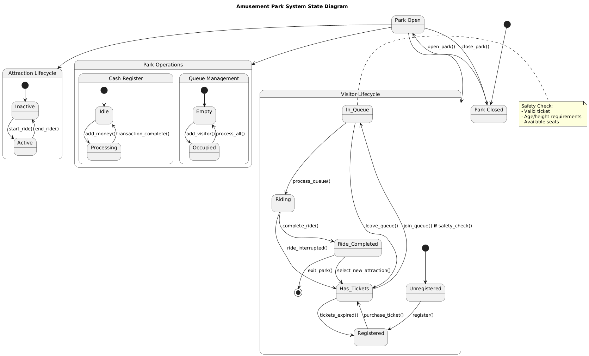

# 🎡 Amusement Park Simulator

## 📌 Overview
**Amusement Park Simulator** is a Python-based command-line application that implements an amusement park simulation using **Object-Oriented Programming (OOP)** principles. It models the park’s functionality through a series of interconnected classes, such as visitors, attractions, and the park system itself.

The program allows visitors to register, purchase tickets, and interact with various attractions, while managing queues, enforcing safety restrictions, and tracking the park's state. 

Additionally, the application is thoroughly tested using **unit tests** to ensure the reliability of the core functionality and proper interaction between components.
## 🚀 Features
- **Object-Oriented Design** – Classes for visitors, attractions, and park management.
- **Attraction Management** – Dynamically add, modify, and manage attractions.
- **Queue System** – Manage attraction queues, ensuring capacity limits are respected.
- **Visitor Interaction** – Register visitors, purchase tickets, and join ride queues.
- **Safety and Restrictions** – Enforce height and age restrictions for certain rides.
- **State Persistence** – Save and load the park state with **pickle**, allowing continuity between runs.
- **CLI Interface** – Interact with the park using a clean command-line interface.
- **Unit Tests** – Ensure system stability with comprehensive testing.
- **Test Coverage** – The app is more than 90% covered by the tests.

## 🔧 Technologies Used  
- **Python** (OOP, CLI)
- **Unittest & Mocks** (unit testing)
- **Pickle** (state persistence)
- **Coverage.py** (test coverage analysis)

## 🛠️ Installation
```sh
# Clone the repository
git clone https://github.com/IRomanchuk06/amusement_park.git
cd amusement_park

# Set up a virtual environment
python -m venv venv
source venv/bin/activate  # On Windows use `venv\Scripts\activate`

# Install dependencies
pip install -r requirements.txt
```

## 🎮 Usage
```sh
python -m src.main
```

### Available Commands:
- `register_new_visitor` – Register a new visitor with their name, age, height, and balance.  
- `view_attractions` – Display the list of available attractions with details.  
- `purchase_ticket` – Purchase a ticket for a visitor for a selected attraction.  
- `join_ride_queue` – Add a visitor to the ride queue for a selected attraction.  
- `operate_attraction` – Start the operation of an attraction and manage the ride queue.  
- `park_status_overview` – Display the current status of the park, including visitors and attractions.  
- `save_park_state` – Save the current park state to a file.  
- `load_park_state` – Load the park state from a file.  
- `add_new_attraction` – Add a new attraction to the park.  
- `top_up_visitor_balance` – Increase a visitor’s balance by a specified amount.  
- `exit_system` – Exit the system and end the session.

## 📂 Project Structure
```
📁 amusement-park-simulator
├── src
│   ├── models
│   │   ├── amusement_park.py
│   │   ├── park_models.py
│   │   ├── visitor.py
│   │   ├── workers.py
│   ├── utils
│   │   ├── park_utils.py
│   │   ├── serialization_utils.py
│   ├── ui.py
│   ├── main.py
├── tests
│   ├── test_amusement_park.py
│   ├── test_park_models.py
│   ├── test_serialization.py
│   ├── test_utils.py
│   ├── tests.py
├── docs
│   ├── classes_my_project.png
│   ├── packages_my_project.png
├── README.md
├── requirements.txt
├── .gitignore
```

## 🖼️ UML Diagrams
### Class Diagram


### States Diagram


### Packages Diagram


## ✅ Testing
```sh
python -m unittest discover -s tests
```
## 📊 Test Coverage  

To check test coverage, use `coverage.py`:  

1. **Install `coverage` (if not installed):**  
   ```sh
   pip install coverage
   ```

2. **Run tests with coverage tracking:**  
   ```sh
   coverage run -m unittest discover -s tests
   ```

3. **Display the coverage report in the terminal:**  
   ```sh
   coverage report -m
   ```

4. **Generate an HTML report:**  
   ```sh
   coverage html
   ```
   Open `htmlcov/index.html` in a browser to view a detailed report.

